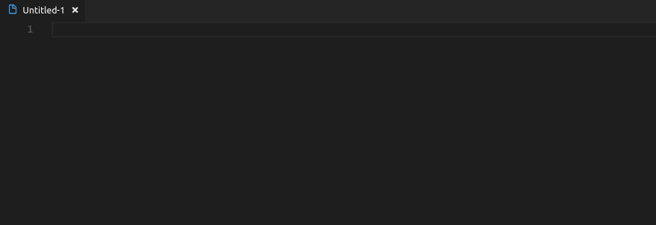

# Insert Unicode

This is an extension for [Visual Studio Code](https://code.visualstudio.com/) which adds commands for inserting Unicode characters/codes and Emoji.

## Features

### Inserting Individual Characters/Codes

There are commands for inserting Unicode characters as text or as hex codes. There are variations for both commands that search for an exact name rather than a substring to facilitate faster insertion when the name is known.


When binding a command to a keyboard shortcut, the search string can be provided as an argument. E.g. to quickly insert skintone modifier characters:

```json
{
	"key": "ctrl+e ctrl+f",
	"command": "insert-unicode.insertText",
	"args": "fitzpatrick"
}
```



The exact command variants can be used to directly insert a given character, e.g. `FIRE`:

```json
{
	"key": "ctrl+e f",
	"command": "insert-unicode.insertTextExact",
	"args": "fire"
}
```

### Inserting/Replacing Text With a "Unicode Font"

This command inserts/replaces Latin alphabetic characters with unicode variations that give them another appearance. Whether these characters can be displayed properly depends on the font, of course.

When the command is invoked the user can select the font style:


This command can also be bound using an argument to specify the font, e.g.:

```json
{
	"key": "ctrl+e f",
	"command": "insert-unicode.insertFont",
	"args": "Math Fraktur Bold"
}
```

### Identify Unicode Characters

This command will show the Unicode name and code point of the selected characters.

Example text:

```plain
🇳🇵👌🏻🔥
```

Output:

```plain
🇳: REGIONAL INDICATOR SYMBOL LETTER N (0x1f1f3)
🇵: REGIONAL INDICATOR SYMBOL LETTER P (0x1f1f5)
👌: OK HAND SIGN (0x1f44c)
🏻: EMOJI MODIFIER FITZPATRICK TYPE-1-2 (0x1f3fb)
🔥: FIRE (0x1f525)
```

Note that joint characters are split up in the analysis.

(The message window will not display line breaks, but there is a button that opens the result in a new file. Right clicking the notification and selecting "Copy" will also preserve the line breaks.)

### Direct Hex Code Input

If you happen to know the exact code, the command `Insert Unicode from Hex Code` can be used.

## Unicode Standards Versions

- Unicode Standard: 12.0.0
- Unicode Emoji: 12.0

## Known Issues

- Some of "fonts" do not convert correctly.
- The unicode fonts may confuse word wrapping, which is an issue on the side of VS Code itself.

## Supporting the Unicode Consortium

Are you a fan of Unicode? There is a program to [adopt a Unicode character](https://unicode.org/consortium/adopted-characters.html) whose donations are used to preserve the linguistic heritage of the world.

I think it would be nice to jointly adopt a character at the silver level as the users of this extension. To that end I will now accept donations; it would only take 100 people to donate $10 to reach the target of $1000. Personally, I am a great fan of ✨, so that is my proposed character of choice.

[](https://www.paypal.com/cgi-bin/webscr?cmd=_s-xclick&hosted_button_id=2T6SWF4FPZ8S4&source=url)

[[Progress Tracking Issue]](https://github.com/brunnerh/insert-unicode/issues/4)

**Note:** I will keep donations open for at least one year starting with the Unicode v.12 release (🎉) on 2019-03-05. Donations will *not* be refundable. If reaching the target appears to be unfeasible at any point after the elapsed year, the donations may be given to another charitable cause!