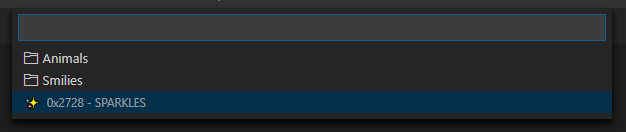

# Insert Unicode

This is an extension for [Visual Studio Code](https://code.visualstudio.com/) which adds commands for inserting Unicode characters/codes and Emoji.

The commands can be executed via the command palette (`View` > `Command Palette...`/ `Ctrl` + `Shift` + `P`) or bound to keyboard shortcuts.

No keys are bound by default. Use the command `Preferences: Open Keyboard Shortcuts` to add custom keyboard shortcuts.

## Features

In this section the various commands will be explained. Every subsection first lists the commands that it is about (the prefix common to all commands, `Insert Unicode:`, is omitted for brevity).

The command identifier (used in custom keyboard shortcuts) will be given in parentheses (again, the prefix `insert-unicode.` is omitted).

### Inserting Individual Characters/Codes

- *Insert* (`insertText`)
- *Insert as Decimal Code* (`insertDecimalCode`)
- *Insert as Hex Code* (`insertCode`)
- *Insert Exact* (`insertTextExact`)
- *Insert Exact as Decimal Code* (`insertDecimalCodeExact`)
- *Insert Exact as Hex Code* (`insertCodeExact`)

These commands insert Unicode characters as text, decimal or hex codes.

The "exact" variations search for an exact name rather than a substring to facilitate faster insertion when the name is known (particularly useful for custom keyboard shortcuts).

Example for *Insert*, searching for `fire`:


When binding a command to a keyboard shortcut, the search string can be provided as an argument. Note that the UI for binding keyboard shortcuts currently does not support setting arguments, so the JSON file has to be edited (execute command `Preferences: Open Keyboard Shortcuts (JSON)`).

E.g. to quickly insert skintone modifier characters:

```json
{
	"key": "ctrl+e ctrl+f",
	"command": "insert-unicode.insertText",
	"args": "fitzpatrick"
}
```

The "exact" directly inserts a given character, e.g. `FIRE`, which otherwise would lead to multiple results, including characters like `FIREWORKS` and `FIRE ENGINE`:

```json
{
	"key": "ctrl+e f",
	"command": "insert-unicode.insertTextExact",
	"args": "fire"
}
```

### Insert From Favorites

- *Insert from Favorites* (`insertFavoriteText`)
- *Insert from Favorites as Decimal Code* (`insertFavoriteDecimalCode`)
- *Insert from Favorites as Hex Code* (`insertFavoriteHexCode`)
- *Manage Favorites* (`manageFavorites`)

These commands insert characters from a favorites directory tree.



Favorites can be configured via the *Manage Favorites* command, which opens an editor:


The buttons prefixed with `+` add new directories/favorite entries respectively. `x` removes directories/favorites. Clicking the folder icon in front of the directory name expands/collapses the contents. Directories can be renamed by clicking the name and editing it.

`Save` (Ctrl+S) saves changes to the settings file.<br/>
`Revert` reloads the favorites from the settings, discarding any changes.

### Inserting/Replacing Text With a "Unicode Font"

- *Insert/Replace Text With "Unicode Font"* (`insertFont`)

This command inserts/replaces Latin alphabetic characters with unicode variations that give them another appearance. Whether these characters can be displayed properly depends on the font, of course.

When the command is invoked the user can select the font style:


This command can also be bound using an argument to specify the font, e.g.:

```json
{
	"key": "ctrl+e f",
	"command": "insert-unicode.insertFont",
	"args": "Math Fraktur Bold"
}
```

### Identify Unicode Characters

- *Identify Characters* (`identify`)

This command will show the Unicode name and code point of the selected characters.

Example text:

```plain
🇳🇵👌🏻🔥
```

Output:

```plain
🇳: REGIONAL INDICATOR SYMBOL LETTER N (0x1f1f3)
🇵: REGIONAL INDICATOR SYMBOL LETTER P (0x1f1f5)
👌: OK HAND SIGN (0x1f44c)
🏻: EMOJI MODIFIER FITZPATRICK TYPE-1-2 (0x1f3fb)
🔥: FIRE (0x1f525)
```

Note that joint characters are split up in the analysis.

The message window will not display line breaks, but there is a button that opens the result in a new file. Right clicking the notification and selecting "Copy" will also preserve the line breaks.

You can always open the output in a new file by changing the setting *Show Identified Characters in File* (`insert-unicode.show-identified-characters-in-file`).

### Direct Hex Code Input

- *Insert from Hex Code* (`fromHexCode`)

If you happen to know the exact hexadecimal code, this command can be used to insert the corresponding character.

## How To?

### Insert Compound Characters, Apply Accents and Modifiers

If you e.g. want to apply a *grave accent* to an `e` (resulting in `è`), you first type out the character to be modified and then insert the modifier, in this case `COMBINING GRAVE ACCENT` (`0x300`).

Modifiers that can be applied to the previous character generally have *combining* in their name. The stand-alone character version of grave accent would be `GRAVE ACCENT` (`0x60`).

There is another method of combining characters that uses a dedicated character for joining other characters, e.g. the `ZERO WIDTH JOINER` (`0x200d`) which is used e.g. in the various family emoji. The family consisting of a man, woman and a girl (👨‍👩‍👧), e.g. is written as `MAN` `ZWJ` `WOMAN` `ZWJ` `GIRL` (`0x1f468` `0x200d` `0x1f469` `0x200d` `0x1f467`).

In general, if you see a special character or symbol and do not know how to write it, try copying it into VS Code and execute the [*Identify Characters*](#identify-unicode-characters) command on it.

## Unicode Standards Versions

- Unicode Standard: 12.0.0
- Unicode Emoji: 12.0

## Known Issues

- Some of "fonts" do not convert correctly.
- The unicode fonts may confuse word wrapping, which is an issue on the side of VS Code itself.

## Supporting the Unicode Consortium

Are you a fan of Unicode? There is a program to [adopt a Unicode character](https://unicode.org/consortium/adopted-characters.html) whose donations are used to preserve the linguistic heritage of the world.

I think it would be nice to jointly adopt a character at the silver level as the users of this extension. To that end I will now accept donations; it would only take 100 people to donate $10 to reach the target of $1000. Personally, I am a great fan of ✨, so that is my proposed character of choice.

[](https://www.paypal.com/cgi-bin/webscr?cmd=_s-xclick&hosted_button_id=2T6SWF4FPZ8S4&source=url)

[[Progress Tracking Issue]](https://github.com/brunnerh/insert-unicode/issues/4)

**Note:** I will keep donations open for at least one year starting with the Unicode v.12 release (🎉) on 2019-03-05. Donations will *not* be refundable. If reaching the target appears to be unfeasible at any point after the elapsed year, the donations may be given to another charitable cause!


# Attribution

- [microsoft/vscode-codicons][1] ([License][2]) - Slightly modified icons from this project are used.


 [1]: https://github.com/microsoft/vscode-codicons
 [2]: https://github.com/microsoft/vscode-codicons/blob/master/LICENSE