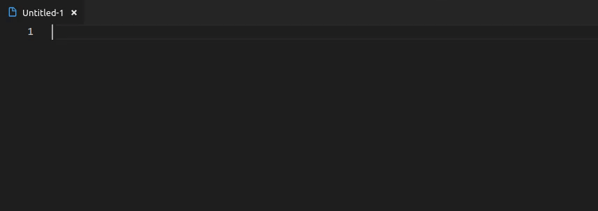
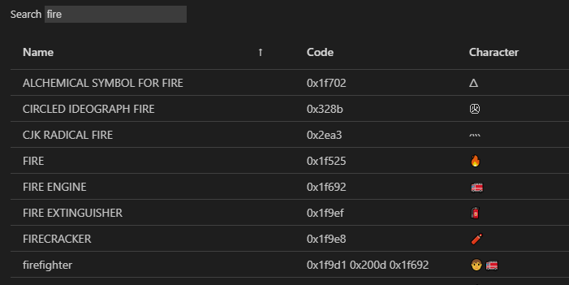

# Insert Unicode

This is an extension for [Visual Studio Code](https://code.visualstudio.com/) which adds commands for inserting Unicode characters/codes and Emoji.

The commands can be executed via the command palette (`View` > `Command Palette...`/ `Ctrl` + `Shift` + `P`) or bound to keyboard shortcuts.

No keys are bound by default. Use the command `Preferences: Open Keyboard Shortcuts` to add custom keyboard shortcuts.

<details>
<summary>Table of Contents</summary>

- [Insert Unicode](#insert-unicode)
	- [Features](#features)
		- [Inserting Individual Characters/Codes](#inserting-individual-characterscodes)
		- [Insert From Favorites](#insert-from-favorites)
		- [Inserting/Replacing Text With a "Unicode Font"](#insertingreplacing-text-with-a-unicode-font)
		- [Identify Unicode Characters](#identify-unicode-characters)
			- [Identify View](#identify-view)
		- [Direct Hex Code Input](#direct-hex-code-input)
		- [Unicode Data Table](#unicode-data-table)
		- [Recently Used Characters](#recently-used-characters)
	- [How To?](#how-to)
		- [Insert Compound Characters, Apply Accents and Modifiers](#insert-compound-characters-apply-accents-and-modifiers)
	- [Unicode Standards Versions](#unicode-standards-versions)
	- [Known Issues](#known-issues)
	- [Attribution](#attribution)
</details>

## Features

In this section the various commands will be explained. Every subsection first lists the commands that it is about (the prefix common to all commands, `Insert Unicode:`, is omitted for brevity).

The command identifier (used in custom keyboard shortcuts) will be given in parentheses (again, the prefix `insert-unicode.` is omitted).

### Inserting Individual Characters/Codes

- *Insert* (`insertText`)
- *Insert as Decimal Code* (`insertDecimalCode`)
- *Insert as Hex Code* (`insertCode`)
- *Insert Exact* (`insertTextExact`)
- *Insert Exact as Decimal Code* (`insertDecimalCodeExact`)
- *Insert Exact as Hex Code* (`insertCodeExact`)
- *Insert Emoji* (`insertEmojiText`)
- *Insert Emoji as Decimal Code* (`insertEmojiDecimalCode`)
- *Insert Emoji as Hex Code* (`insertEmojiHexCode`)

These commands insert Unicode characters as text, decimal or hex codes.

The "exact" variants search for an exact name rather than a substring to facilitate faster insertion when the name is known (particularly useful for custom keyboard shortcuts).

The "Emoji" variants limit the search to characters classified as [Emoji][3].

Example for *Insert*, searching for `fire`:



When binding a command to a keyboard shortcut, the search string can be provided as an argument. Note that the UI for binding keyboard shortcuts currently does not support setting arguments, so the JSON file has to be edited (execute command `Preferences: Open Keyboard Shortcuts (JSON)`).

E.g. to quickly insert skin tone modifier characters:

```json
{
	"key": "ctrl+e ctrl+f",
	"command": "insert-unicode.insertText",
	"args": "fitzpatrick"
}
```

The "exact" directly inserts a given character, e.g. `FIRE`, which otherwise would lead to multiple results, including characters like `FIREWORKS` and `FIRE ENGINE`:

```json
{
	"key": "ctrl+e f",
	"command": "insert-unicode.insertTextExact",
	"args": "fire"
}
```

### Insert From Favorites

- *Insert from Favorites* (`insertFavoriteText`)
- *Insert from Favorites as Decimal Code* (`insertFavoriteDecimalCode`)
- *Insert from Favorites as Hex Code* (`insertFavoriteHexCode`)
- *Manage Favorites* (`manageFavorites`)

These commands insert characters from a favorites directory tree.


Favorites can be configured via the *Manage Favorites* command, which opens an editor:


The buttons prefixed with `+` add new directories/favorite entries respectively. `x` removes directories/favorites. Clicking the folder icon in front of the directory name expands/collapses the contents. Directories can be renamed by clicking the name and editing it.

`Save` (Ctrl+S) saves changes to the settings files.<br/>
`Revert` reloads the favorites from the settings, discarding any changes.

### Inserting/Replacing Text With a "Unicode Font"

- *Insert/Replace Text With "Unicode Font"* (`insertFont`)

This command inserts/replaces Latin alphabetic characters with Unicode variants that give them another appearance. Whether these characters can be displayed properly depends on the font, of course.

When the command is invoked the user can select the font style:


This command can also be bound using an argument to specify the font, e.g.:

```json
{
	"key": "ctrl+e f",
	"command": "insert-unicode.insertFont",
	"args": "Math Fraktur Bold"
}
```

### Identify Unicode Characters

- *Identify Characters* (`identify`)

This command will show the Unicode name and code point of the selected characters.

Example text:

```plain
🇳🇵👌🏻🔥
```

Output:

```plain
🇳: REGIONAL INDICATOR SYMBOL LETTER N (0x1f1f3)
🇵: REGIONAL INDICATOR SYMBOL LETTER P (0x1f1f5)
👌: OK HAND SIGN (0x1f44c)
🏻: EMOJI MODIFIER FITZPATRICK TYPE-1-2 (0x1f3fb)
🔥: FIRE (0x1f525)
```

Note that joint characters are split up in the analysis.

The message window will not display line breaks, but there is a button that opens the result in a new file. Right clicking the notification and selecting "Copy" will also preserve the line breaks.

You can always open the output in a new file by changing the setting *Show Identified Characters in File* (`show-identified-characters-in-file`).

#### Identify View

There also is the *Identify* view in the Explorer sidebar which performs the identification of characters in the current selection on the fly. The view can be dragged to its own or another section as well as hidden via the context menu on the section title.


There are settings for adjusting the update rate and maximal number of identified characters if performance adjustments are necessary. While the view is not visible (i.e. collapsed or hidden) it will not perform any lookups.

### Direct Hex Code Input

- *Insert from Hex Code* (`fromHexCode`)

If you happen to know the exact hexadecimal code, this command can be used to insert the corresponding character.

### Unicode Data Table

- *Data Table* (`dataTable`)

Shows the Unicode data set as a big data table.



The entries are filtered according to the settings *Include Sequences* (`include-sequences`) and *Include Skin Tone Variants* (`include-skin-tone-variants`).

### Recently Used Characters

When inserting individual characters, the extension keeps track of recently used entries and subsequently shows them at the top of list.

This behavior can be disabled via the option *Enable Recently Used* (`enableRecentlyUsed`). The length of this list can be set via *Recently Used Limit* (`recentlyUsedLimit`).

The command *Clear Recently Used List* (`clearRecentlyUsed`) clears this temporary list.

## How To?

### Insert Compound Characters, Apply Accents and Modifiers

If you e.g. want to apply a *grave accent* to an `e` (resulting in `è`), you first type out the character to be modified and then insert the modifier, in this case `COMBINING GRAVE ACCENT` (`0x300`).

Modifiers that can be applied to the previous character generally have *combining* in their name. The stand-alone character version of grave accent would be `GRAVE ACCENT` (`0x60`).

There is another method of combining characters that uses a dedicated character for joining other characters, e.g. the `ZERO WIDTH JOINER` (`0x200d`) which is used e.g. in the various family emoji. The family consisting of a man, woman and a girl (👨‍👩‍👧), e.g. is written as `MAN` `ZWJ` `WOMAN` `ZWJ` `GIRL` (`0x1f468` `0x200d` `0x1f469` `0x200d` `0x1f467`).

In general, if you see a special character or symbol and do not know how to write it, try copying it into VS Code and execute the [*Identify Characters*](#identify-unicode-characters) command on it.

## Unicode Standards Versions

- Unicode Standard: 15.0.0
- Unicode Emoji: 15.0

## Known Issues

- Some of "fonts" do not convert correctly.
- The unicode fonts may confuse word wrapping, which is an issue on the side of VS Code itself.

## Attribution

- [microsoft/vscode-codicons][1] ([License][2]) - Slightly modified icons from this project are used.


 [1]: https://github.com/microsoft/vscode-codicons
 [2]: https://github.com/microsoft/vscode-codicons/blob/master/LICENSE
 [3]: https://en.wikipedia.org/wiki/Emoji
